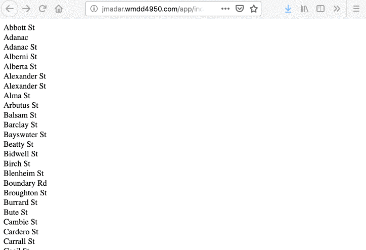

# Introduction

Goal: We want to deploy a nodejs application on the Internet using a linux server on AWS EC2.  How do we do it?

Answer: watch this video: https://youtu.be/ieFelM6Kh2Y 

Pay attention to the following:

  - apt is used to install additional software packages on Ubuntu.
    It’s known as a “package manager”.
  - Once installed, the node command will be available in bash
  - You will need to install npm separately
  - sudo is required if you need access to privileged areas
    (special file system area, restarting system services, etc.) 
  - Apache can host multiple sites (differentiated by DNS name),
    each host will need a separate configuration
  - The apache configuration details are called directives 
  - The DocumentRoot directive specifies which directory to server the html
    files if no ProxyPass directives are present
  - In our example, we are changing  the html files to be served from the
    node-test directory, however, since we have a ProxyPass directive on the /
    path, no html files are served
  - We use the ProxyPass directive to redirect requests to a different port
    (or even a different server!)
  - ADVANCED: For every ProxyPass, you’ll also need to provide a corresponding
    ProxyPassReverse so the http headers are re-written properly
  - Experiment by commenting out each directive and observe the result
  - You can deploy multiple node apps via a single apache server by ProxyPass
    to different paths and ports
  - We need to use the apachectl restart command to restart a server every time
    a configuration file is added/changed

# Steps

In this assignment, you will be building your own version of the 3
tier web application.  For simplicity, all three “servers” will be running under
one single AWS EC2 Linux instance.

  1. Start by making sure that your Linux machine has the following
     (you should have been completed from the web-admin-basics lesson
     https://github.com/wmdd-langara/web-admin-basics)
     
       - Have a permanent IP address via AWS’s Elastic IP service 
       - Have a proper DNS entry (xxx.wmdd4950.com)
       - Virtual Host configuration setup
       - Make sure Apache is install 

  1. We will be running a node application, so you will need NodeJS installed.
     So make sure node and npm are installed via apt.

  1. Clone my example NodeJS app repo into your linux machine, I am installing it
     under ~/full-stack-example-1 using the following commands:

     ```
     cd ~
     # make sure git is installed and clone the repo into ./app
     git clone https://github.com/env3d/full-stack-example-1.git
     # enter the app directory and install dependencies
     cd app; npm install

     ```
  1. Launch this node app by issuing the `nohup npm start &` command.
     (Note: nohup will ensure that the stdout is written to a file and
     the app won’t exit when we exit the shell).

       - After you run the above command, use the exit command to logout
         of your server.  If you simply close the terminal window, it may
	 kill the background app
	 
       - NOTE: the node js app is running under the user ubuntu

  1. Modify your apache vhost configuration so that the /full-stack-api path of your
     web server acts as a reverse proxy to localhost.  If you do this correctly,
     http://xxx.wmdd4950.com/full-stack-api  (where xxx is your sub-domain) will point
     to localhost:8080 (your running node app).

       - Take a look inside the `~/full-stack-example-1/index.js` file to which routes
         are available and try calling them
  
       - To access a particular route, you will need to prefix it with
         http://xxx.wmdd4950.com/full-stack-example-1/, for example, if there is a route
	 for “info”, you will access that route using the url
	 http://xxx.wmdd4950.com/full-stack-example-1/info
	 
       - Your apache configuration `/etc/apache2/sites-available/000-default.conf` file
         should look have the following directives:

         ```
         <VirtualHost *:80>
                 DocumentRoot /var/www/html
                 ProxyPass /full-stack-example-1 http://localhost:8080
                 ProxyPassReverse /full-stack-example-1 http://localhost:8080
         </VirtualHost>
         ```
	 
         This is how my APIs are deployed

  1. There is a static frontend in the public directory of the git repo
     (it’s simply an index.html file).  Move the frontend to the
     `/var/www/html/full-stack-app` 
     directory on the web server so it can be accessed with the url
     http://xxx.wmdd4950.com/full-stack-app/.
     You will need to modify the frontend so all the api references are correct.

     


## NOTES

  - To test your configuration files, use apachectl -t
  - To enable the changes after you modify apache configuration, you need to
    restart apache
  - ProxyPass definition (or any apache directives), is done per virtual host, and
    must appear inside the &lt;VirtualHost&gt;&lt;/VirtualHost&gt; tags
  - Directives appearing outside of the &lt;VirtualHost&gt; tag are applied server-wide.
    To organize your configuration files better, you may want to use the _default_ vhost
    (https://httpd.apache.org/docs/2.4/vhosts/examples.html#default) 
  - If you want to launch a new server (maybe you messed up the old one), disassociate
    the elastic IP and re-associate to the new server.  That way the DNS entry do not
    have to change

# Hand-in

Clone the assignment repo into your ${HOME} directory, then execute `pytest` in the
`${HOME}/${ASSIGNMENT_REPO}/` to check if you got everything correct.

When you are satisified, run the following commands to submit:

    - `git add -A`
    - `git commit -a -m 'submit'`
    - `git push`
